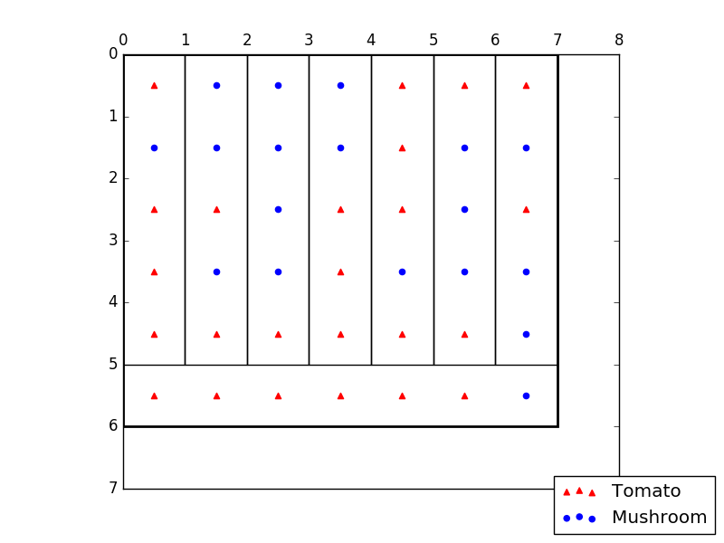

# Running instructions
To run this script: 
```
python main.py
```

An input file with the representation of the pizza can be specified with the -i option:
```
python main.py -i example.in
```

# Description
This solution uses a one-size slice, loops over all the cells in the pizza, and tries to place the slice with that cell as its starting position. The size of the slice is one cell in width and *max allowed number of cells per slice* in height. 

